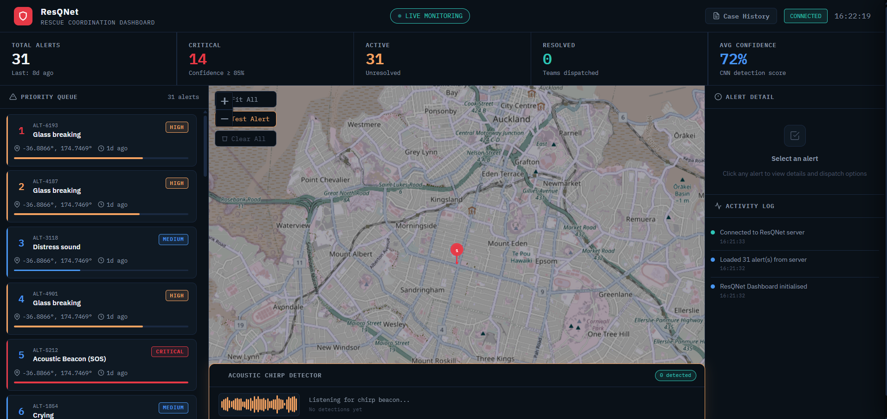
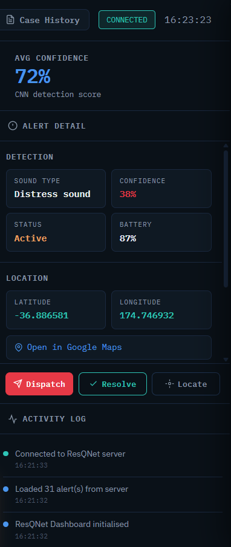
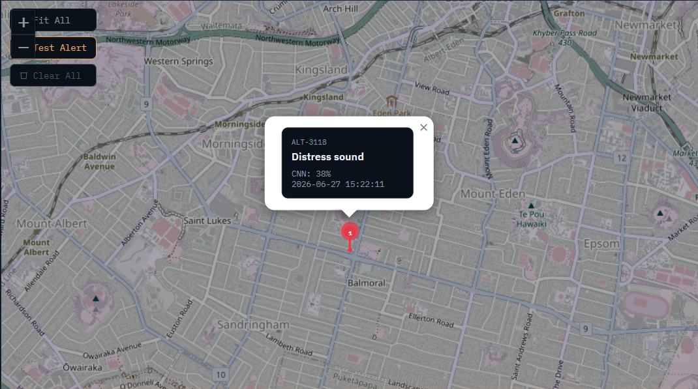

# ResQNet 🛡️
### Autonomous Distress Detection and Delay-Tolerant Emergency Communication for Disaster Scenarios

<p align="center">
  
</p>

<p align="center">
  
  
  
  
  
</p>

---

## 📖 Abstract

ResQNet is an **infrastructure-independent emergency response system** that automatically detects human distress sounds and transmits emergency alerts without relying on internet connectivity or cellular infrastructure. Designed for disaster scenarios where communication systems fail, ResQNet runs entirely on commodity Android smartphones using on-device edge AI inference.

The system combines:
- A **CNN-based distress detection pipeline** (84.8% accuracy, threshold-optimised for real-world deployment)
- A **5-gate false positive filtering architecture** validated on real devices
- **Multi-channel alert transmission** (SMS → Telegram → Dashboard → Bluetooth mesh → Acoustic chirp beacon)
- A **Classic Bluetooth relay fallback** for budget devices where BLE advertising is hardware-limited
- A **web-based rescue coordination dashboard** with real-time GPS mapping

> This project is part of an MSE907 Capstone Research Project at Yoobee College, supervised by Dr. Prakash Kumar Karn. Target publication: IEEE Global Humanitarian Technology Conference (GHTC) 2026.

---

## 📱 App Screenshots

<table>
  <tr>
    <td align="center">
      
      <br/><b>Home Screen</b>
    </td>
    <td align="center">
      
      <br/><b>Disaster Mode Active</b>
    </td>
    <td align="center">
      
      <br/><b>Distress Alert Fired</b>
    </td>
  </tr>
  <tr>
    <td align="center">
      
      <br/><b>Emergency Contacts</b>
    </td>
    <td align="center">
      
      <br/><b>Alert History</b>
    </td>
    <td align="center">
      
      <br/><b>Dashboard Settings</b>
    </td>
  </tr>
</table>

---

## 🖥️ Rescue Coordination Dashboard

<p align="center">
  
  <br/><i>Real-time rescue coordination dashboard showing live GPS mapping, alert priority queue, and chirp beacon detection</i>
</p>

<table>
  <tr>
    <td align="center">
      
      <br/><b>Alert Priority Queue</b>
    </td>
    <td align="center">
      
      <br/><b>Acoustic Chirp Beacon Detector</b>
    </td>
  </tr>
  <tr>
    <td align="center">
      
      <br/><b>Live GPS Victim Map</b>
    </td>
    <td align="center">
      
      <br/><b>Case History Sidebar</b>
    </td>
  </tr>
</table>

---

## 🏗️ System Architecture

ResQNet operates across four independent layers:

```
┌─────────────────────────────────────────────────────────┐
│  Layer 1 — AI-Based Autonomous Distress Detection        │
│  Microphone → Mel-Spectrogram → CNN (TFLite) → 5-Gates  │
├─────────────────────────────────────────────────────────┤
│  Layer 2 — Multi-Channel Emergency Communication         │
│  SMS → Telegram → HTTP Dashboard → BT Mesh → Classic BT │
├─────────────────────────────────────────────────────────┤
│  Layer 3 — Acoustic Victim Localization                  │
│  2–4 kHz Chirp Beacon → Python Detector → Dashboard     │
├─────────────────────────────────────────────────────────┤
│  Layer 4 — Rescue Coordination Dashboard                 │
│  React.js + Flask + Socket.IO + Leaflet.js GPS Map      │
└─────────────────────────────────────────────────────────┘
```

---

## ✨ Key Features

| Feature | Description |
|---|---|
| 🤖 **On-device CNN** | TFLite model classifies screaming, crying, glass breaking, fearful speech — no internet required |
| 🛡️ **5-Gate False Positive Filter** | RMS gate → CNN threshold → streak count → avg confidence gate → avg RMS gate |
| 📱 **Background Detection** | Native Kotlin foreground service survives screen-off and Samsung battery optimization |
| 📡 **Classic BT Relay** | Fallback relay using Bluetooth device name field — works on budget devices where BLE advertising fails |
| 🔊 **Acoustic Chirp Beacon** | 2–4 kHz sweep detectable through disaster-level noise, guides rescue teams to victims |
| 🗺️ **Live GPS Dashboard** | Web-based real-time alert map with priority queue and team dispatch |
| 📲 **Multi-channel Alerts** | Simultaneous SMS, Telegram, and HTTP dashboard — each channel fails independently |
| 💾 **Store-and-Forward** | Alerts queued in SQLite and retransmitted when connectivity restores (DTN) |

---

## 🔬 CNN Model Performance

| Metric | Value |
|---|---|
| Overall Accuracy | 84.8% |
| Precision | 96.5% |
| Recall | 69.9% |
| Detection Threshold | 0.20 (optimised from 0.50) |
| False Positive Rate (real-world) | 0% (with 5-gate filter) |
| Inference Device | Samsung Galaxy M10 (budget Android) |

### Real-Device False Positive Analysis

Empirical testing revealed a clean energy gap between false positives and true positives:

```
False positives (speech, ambient): RMS  0.008 – 0.043
                                   ← GATE at 0.050 →
True positives (genuine distress): RMS  0.068 – 0.159
```

This gap enabled the design of the evidence-based RMS gate that eliminates false alerts without affecting genuine distress detection.

---

## 🚀 Getting Started

### Prerequisites

- Flutter SDK ≥ 3.0
- Android Studio with Android SDK
- Python 3.9+ (for dashboard and chirp detector)
- Android device running Android 8.0+ (tested on Samsung Galaxy M10, A10)

### 1. Clone the repository

```bash
git clone https://github.com/OshiMSC/Master-s-Research-Project.git
cd Master-s-Research-Project
```

### 2. Set up the Flutter app

```bash
cd flutter_app/echosense_app
flutter pub get
flutter run
```

> **Note:** The training datasets are not included in this repository due to size. Download them separately — see [Dataset Setup](#-dataset-setup) below.

### 3. Set up the rescue dashboard

```bash
cd rescue_dashboard
pip install -r requirements.txt
python app.py
```

The dashboard will start at `http://localhost:5000`. Open it in a browser on the same WiFi network as the phone.

### 4. Configure the phone

1. Open the ResQNet app
2. Go to Settings → Dashboard IP and enter your laptop's local IP address (e.g. `192.168.1.100`)
3. Add an emergency contact number
4. Enable Disaster Mode

> **Samsung devices:** Go to Settings → Device Care → Battery → App power management → ResQNet → set to **Unrestricted**. This prevents Samsung One UI from killing the background microphone service.

---

## 📦 Project Structure

```
Master-s-Research-Project/
├── flutter_app/
│   └── echosense_app/              # Main Android app (Flutter + Kotlin)
│       ├── lib/
│       │   ├── audio_service.dart  # 5-gate CNN detection pipeline
│       │   ├── detection_service.dart  # TFLite cross-isolate inference
│       │   ├── mesh_service.dart   # BLE + Classic BT relay
│       │   ├── sms_service.dart    # Multi-channel alert transmission
│       │   └── gps_service.dart    # Location tracking
│       └── android/app/src/main/
│           └── kotlin/
│               ├── DistressDetectionService.kt  # Background foreground service
│               ├── NativeDetectionService.kt    # Native Kotlin CNN pipeline
│               ├── NativeAlertService.kt        # Native alert + GPS
│               └── MainActivity.kt
├── rescue_dashboard/
│   ├── app.py                      # Flask + Socket.IO backend
│   ├── dashboard.html              # Real-time rescue coordination UI
│   └── chirp_detector.py          # Acoustic chirp beacon detector
├── ai_pipeline/
│   └── scripts/
│       ├── train_model.py          # CNN training script
│       ├── preprocess.py           # Mel-spectrogram preprocessing
│       └── evaluate.py             # Model evaluation
└── docs/
    └── images/                     # Screenshots for this README
```

---

## 🗄️ Dataset Setup

The training datasets are not committed to this repository. Download them from:

| Dataset | Source | Used For |
|---|---|---|
| ESC-50 | [GitHub](https://github.com/karolpiczak/ESC-50) | Crying, glass breaking, wind, rain |
| UrbanSound8K | [Kaggle](https://www.kaggle.com/datasets/chrisfilo/urbansound8k) | Screaming, street sounds |
| RAVDESS | [Kaggle](https://www.kaggle.com/datasets/uwrfkaggler/ravdess-emotional-speech-audio) | Fearful speech, angry speech |
| Kaggle Screaming | [Kaggle](https://www.kaggle.com/datasets) | Human screaming audio |

Place downloaded datasets in `ai_pipeline/scripts/datasets/` — this folder is excluded from Git via `.gitignore`.

---

## 🛠️ Technology Stack

| Category | Technology |
|---|---|
| Mobile App | Flutter (Dart) + Native Kotlin |
| On-device AI | TensorFlow Lite, Mel-spectrogram |
| Dashboard | React.js, Flask, Socket.IO, Leaflet.js |
| Communication | Android SmsManager, Telegram Bot API, Classic Bluetooth |
| Database | SQLite (sqflite) |
| Location | Android FusedLocationProvider, Geolocator |
| Audio | flutter_sound, Android AudioRecord |
| Model Training | TensorFlow/Keras, Python, Google Colab (NVIDIA T4 GPU) |

---

## 🔑 Key Technical Discoveries

### 1. Flutter Compute() Isolate Bug
Flutter's `compute()` function spawns isolates with independent memory — static state (including the TFLite interpreter) is not shared. All CNN readings were silently falling back to `RMS × 2.0` simulation. Fixed using `Interpreter.fromAddress()` to share the native memory address across the isolate boundary.

### 2. BLE Advertising Hardware Limitation
The Samsung Galaxy M10 cannot execute `startAdvertisingSet` — `PlatformException(18)` at the chipset level. Resolved by implementing Classic Bluetooth device name broadcasting as a relay fallback (confirmed working at RSSI −31 dBm).

### 3. OEM Battery Optimization
Samsung One UI silently terminates background microphone access. Fixed by implementing a native Kotlin foreground service with a persistent notification, bypassing Flutter engine lifecycle entirely.

---

## 📊 Evaluation Plan

14 controlled experiments across 5 groups:

| Group | Experiments | Primary Metric |
|---|---|---|
| A: CNN Detection | E1 Screaming, E2 Crying, E3 Glass breaking | True Positive Rate, Latency |
| B: FP Rejection | E4 Normal speech, E5 Storm noise | False Positive Rate (target: 0%) |
| C: Noise Robustness | E6 SNR 0 dB, E7 −10 dB, E8 −20 dB | Detection rate at each SNR |
| D: Communication | E9 SMS content, E10 Store-forward, E11 Manual SOS | Delivery rate, Latency |
| E: Integration | E12 Chirp range, E13 End-to-end, E14 BT relay | Range (m), Total latency (s) |

---

## 📚 Research Context

**Programme:** Master of Software Engineering (Level 9), Yoobee College of Creative Innovation  
**Course:** MSE907 Industry-based Capstone Research Project  
**Student:** Oshadee Kaushalya (ID: 270648042)  
**Supervisor:** Dr. Prakash Kumar Karn  
**Target Publication:** IEEE Global Humanitarian Technology Conference (GHTC) 2026  

### Motivation
Cyclone Gabrielle (New Zealand, 2023) and Cyclone Ditwah (Sri Lanka) demonstrated how quickly communication infrastructure fails during large-scale disasters, leaving victims unable to call for help. ResQNet addresses this gap using hardware already in most people's pockets.

---

## ⚠️ Important Setup Notes

- **Samsung Smart Network Switch:** Disable "Switch to mobile data automatically" in WiFi settings. Without this, Android routes local IP traffic to mobile data, making the dashboard unreachable even on the same WiFi network.
- **Background location (Android 10+):** For GPS to work from the background service, set location permission to "Allow all the time" in app settings.
- **Disaster Mode:** This app is designed to be activated only during disaster scenarios, not for continuous daily use. Leaving it on during normal daily life may trigger alerts from conversational speech.

---

## 📄 License

This project is licensed under the MIT License — see the [LICENSE](LICENSE) file for details.

---

## 🙏 Acknowledgements

- Dr. Prakash Kumar Karn — project supervision
- Yoobee College of Creative Innovation — research support
- ESC-50, UrbanSound8K, RAVDESS dataset authors
- tflite_flutter team for the cross-isolate interpreter pattern

---

<p align="center">
  <i>Built with ❤️ for disaster-resilient communities in New Zealand and the Pacific</i>
</p>